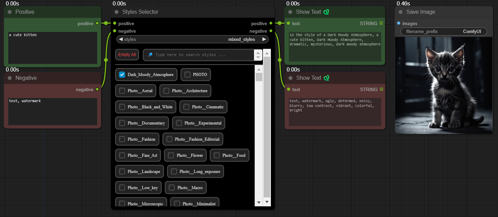
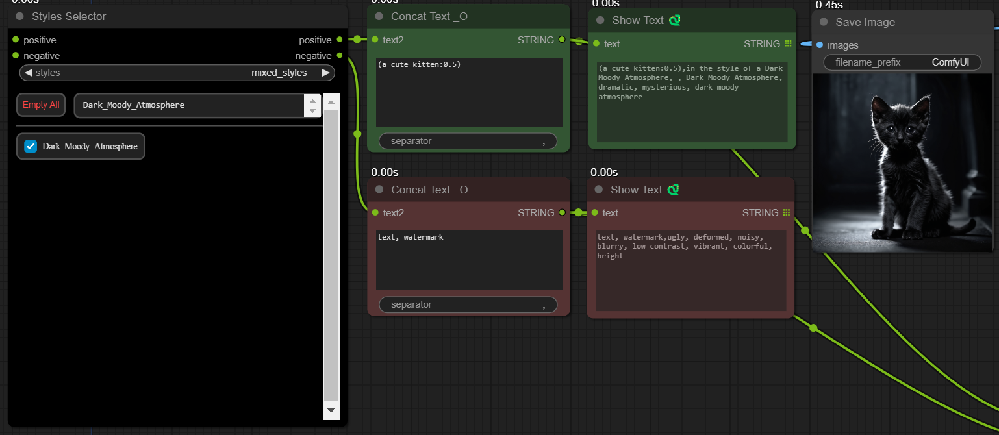

# ComfyUI-Mixed-Utils: Basic Utilities

This private repository, **ComfyUI-Mixed-Utils**, contains basic utilities and styles for ComfyUI, created to share with others.

# ComfyUI-Easy-Use Additional Styles

## Installation

1. Install ComfyUI-Easy-Use using the [ComfyUI Manager](https://github.com/ltdrdata/ComfyUI-Manager).

2. Copy `ComfyUI-Mixed-Utils/mixed_styles/mixed_styles.json` to your local ComfyUI directory:

    ```
    \custom_nodes\ComfyUI-Easy-Use\styles\
    ```

3. Copy all images from `ComfyUI-Mixed-Utils/google_styles/samples/` (excluding the folder itself) to:
    
    ```
    \custom_nodes\ComfyUI-Easy-Use\styles\samples\
    ```

## Usage



To increase/decrease the style's impact



## Notes

1. The sample images provided in this repository were generated using the [Pixart-Sigma Checkpoint](https://huggingface.co/PixArt-alpha/PixArt-Sigma-XL-2-1024-MS). Please be aware that results may vary when using these styles with different models or configurations.

2. The styles follow this naming convention: Category__Style_Name. However, some exceptions apply to styles I've incorporated from SAI and other external sources.